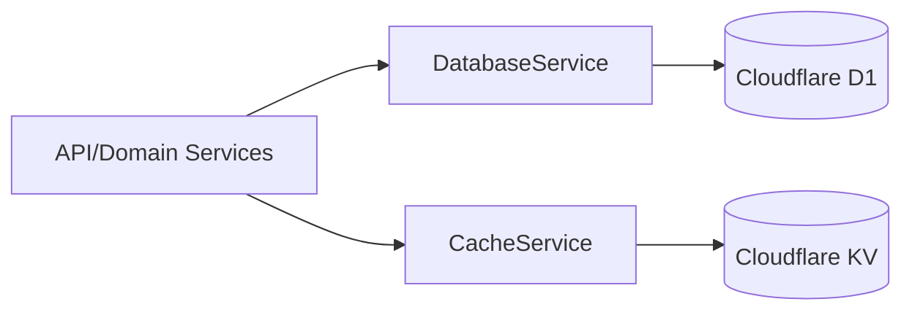

## Taskative Backend Architecture Document

### Introduction

This document outlines the backend architecture for Taskative, used by developers and AI agents as the blueprint for the MVP on Cloudflare Workers.

#### Starter Template or Existing Project

N/A

#### Change Log

| Date       | Version | Description                                                                                                    | Author |
| ---------- | ------- | -------------------------------------------------------------------------------------------------------------- | ------ |
| 2025-09-07 | 0.2     | Introduced DI patterns (DatabaseService, CacheService, lightweight container); updated components and diagrams | PM     |

### High Level Architecture

#### Technical Summary

Multiple Cloudflare Workers (API, Auth, Cron) backed by Cloudflare D1 and a short-TTL cache on KV. Hono handles routing, Prisma defines schema and migrations, and Kysely (with prisma-kysely types) provides type-safe DB access. Bcrypt runs in a dedicated Auth Worker; a single Cron Worker processes reminders. A lightweight DI container builds service instances per request/environment, injecting a `DatabaseService` (typed Kysely/Prisma access) and a `CacheService` (KV wrapper with TTL and namespacing) into application services.

#### High Level Overview

1. Style: Serverless Workers with shared relational store (D1)
2. Repo: Single backend package for MVP
3. Services: API Worker (REST), Auth Worker (bcrypt), Cron Worker (reminders)
4. Flow: Client → API → D1/KV; API → Auth Worker for password ops; Cron scans reminders
5. Decisions: Prisma-first schema, typed Kysely, KV only as cache, device-scoped sessions

#### High Level Project Diagram

```mermaid
graph TD
  U[User] -->|HTTPS| API[API Worker (Hono)]
  API -->|JWT cookie| Auth[Auth Service Worker]
  API --> D1[(Cloudflare D1)]
  API <-->|cache| KV[(Cloudflare KV)]
  Cron[Cron Worker] -->|due reminders| U
  Cron --> D1
```

#### Architectural and Design Patterns

-  **Serverless on Workers:** Low-latency, global edge – Rationale: simplicity and scale
-  **Repository/Query Builder (Kysely):** Typed SQL – Rationale: safety and portability
-  **Cache-aside with KV:** Short TTLs only – Rationale: D1 remains source of truth
-  **Session-backed Auth:** Server-side sessions – Rationale: revocation and device scope
-  **Dependency Injection (constructor-based):** Services receive their dependencies (`DatabaseService`, `CacheService`, config) via constructor injection. Avoid global singletons; prefer per-request/per-env instances from a lightweight container/factory.
-  **Infrastructure Service Wrappers:** Centralize access to DB and KV via `DatabaseService` and `CacheService` interfaces to improve testability and decouple infra from domain logic.

### Tech Stack

#### Cloud Infrastructure

-  **Provider:** Cloudflare
-  **Key Services:** Workers, D1, KV, Cron Triggers, (Future) R2
-  **Deployment Regions:** Global edge

#### Technology Stack Table

| Category      | Technology         | Version           | Purpose               | Rationale                    |
| ------------- | ------------------ | ----------------- | --------------------- | ---------------------------- |
| Language      | TypeScript         | unspecified       | Primary language      | Strong typing, Workers-ready |
| Runtime       | Cloudflare Workers | ^4.4.0 (wrangler) | Runtime               | Global edge                  |
| API Framework | Hono               | ^4.9.0            | Routing               | Lightweight, Workers-first   |
| ORM/Types     | prisma-kysely      | ^1.8.0            | Generate Kysely types | Schema-first typing          |
| Query Builder | Kysely             | ^0.28.4           | Type-safe SQL         | Safety                       |
| DB            | Cloudflare D1      | managed           | Relational store      | Simple on Workers            |
| Cache         | Cloudflare KV      | managed           | Short TTL cache       | Faster reads                 |
| Auth Crypto   | bcryptjs           | ^3.0.2            | Password hashing      | Isolated worker              |
| Tests         | Vitest             | ^3.2.4            | Testing               | Fast TS support              |
| Schema        | Prisma             | ^6.13.0           | Schema & migrations   | Prisma-first workflow        |

### Data Models

#### User

-  Purpose: Identity and profile
-  Columns:
   -  id: TEXT (primary key)
   -  email: TEXT (unique, not null)
   -  password_hash: TEXT (not null)
   -  first_name: TEXT (nullable)
   -  last_name: TEXT (nullable)
   -  username: TEXT (unique, nullable)
   -  profile_image_url: TEXT (nullable)
   -  created_at: DATETIME (default CURRENT_TIMESTAMP)
   -  updated_at: DATETIME (auto-updated)
-  Relationships: Sessions, Groups, Tasks, Reminders, PasswordResetTokens

#### Session

-  Purpose: Server-side sessions backing short-lived JWT cookies; device-scoped revocation
-  Columns:
   -  id: TEXT (primary key)
   -  user_id: TEXT (not null, references users.id, on delete CASCADE)
   -  status: TEXT (default 'active')
   -  created_at: DATETIME (default CURRENT_TIMESTAMP)
   -  expires_at: DATETIME (not null)
   -  revoked_at: DATETIME (nullable)
   -  device_id: TEXT (not null)
   -  device_name: TEXT (not null)
-  Indexes: (user_id), (expires_at)
-  Relationships: N:1 User

#### Group

-  Purpose: Grouping of tasks
-  Columns:
   -  id: TEXT (primary key)
   -  user_id: TEXT (not null, references users.id, on delete CASCADE)
   -  name: TEXT (not null)
   -  color: TEXT (nullable)
   -  created_at: DATETIME (default CURRENT_TIMESTAMP)
   -  updated_at: DATETIME (auto-updated)
-  Relationships: N:1 User; 1:N Tasks

#### Task

-  Purpose: User tasks
-  Columns:
   -  id: TEXT (primary key)
   -  user_id: TEXT (not null, references users.id, on delete CASCADE)
   -  group_id: TEXT (nullable, references groups.id, on delete SET NULL)
   -  title: TEXT (not null)
   -  note: TEXT (nullable)
   -  priority: INTEGER (nullable)
   -  effort: INTEGER (nullable)
   -  deadline: DATETIME (nullable)
   -  repeat_interval: TEXT (nullable)
   -  remind_at: DATETIME (nullable)
   -  status: TEXT (default 'pending')
   -  created_at: DATETIME (default CURRENT_TIMESTAMP)
   -  updated_at: DATETIME (auto-updated)
-  Indexes: (user_id, status, deadline), (user_id, priority, deadline), (title)
-  Relationships: N:1 User; N:1 Group; 1:N Subtasks; 1:N Reminders

#### Subtask

-  Purpose: Child items
-  Columns:
   -  id: TEXT (primary key)
   -  task_id: TEXT (not null, references tasks.id, on delete CASCADE)
   -  title: TEXT (not null)
   -  status: TEXT (default 'pending')
   -  created_at: DATETIME (default CURRENT_TIMESTAMP)
   -  updated_at: DATETIME (auto-updated)
-  Relationships: N:1 Task

#### Reminder

-  Purpose: Scheduled notifications
-  Columns:
   -  id: TEXT (primary key)
   -  task_id: TEXT (not null, references tasks.id, on delete CASCADE)
   -  user_id: TEXT (not null, references users.id, on delete CASCADE)
   -  remind_at: DATETIME (not null)
   -  repeat_interval: TEXT (nullable)
   -  last_sent_at: DATETIME (nullable)
   -  status: TEXT (default 'scheduled')
   -  created_at: DATETIME (default CURRENT_TIMESTAMP)
-  Indexes: (user_id, remind_at)
-  Relationships: N:1 Task; N:1 User

#### PasswordResetToken

-  Purpose: Password reset flows
-  Columns:
   -  id: TEXT (primary key)
   -  user_id: TEXT (not null, references users.id, on delete CASCADE)
   -  token: TEXT (unique, not null)
   -  expires_at: DATETIME (not null)
   -  used_at: DATETIME (nullable)
   -  created_at: DATETIME (default CURRENT_TIMESTAMP)
-  Indexes: (token), (user_id)
-  Relationships: N:1 User

### Components

#### API Worker (Hono)

-  Responsibility: REST endpoints, validation, orchestration
-  Interfaces: /v1/\*
-  Dependencies: DatabaseService, CacheService, Auth Worker (D1 and KV are bound to these via infra adapters). Instances are provided by a lightweight DI container per request or per environment.

#### Auth Service Worker

-  Responsibility: bcrypt password hashing/verify
-  Interfaces: Internal RPC/HTTP
-  Dependencies: none

#### Cron Worker (Reminders)

-  Responsibility: Scan due reminders and send notifications
-  Interfaces: Scheduled trigger
-  Dependencies: D1

### Dependency Injection and Infrastructure Services

The application uses a lightweight container/factory to wire services with shared infrastructure dependencies and configuration.

-  Interfaces

   -  `DatabaseService`: strongly-typed access over generated Kysely `DB` types, transaction helpers, and optional raw SQL execution when necessary.
   -  `CacheService`: minimal KV API with namespaced key helpers; supports `get`, `set` (with TTL), `delete`, and batch delete.

-  Container/Factory

   -  `createContainer(env) -> { db: DatabaseService, cache: CacheService, ... }` where `env` carries Worker bindings (D1, KV, config).
   -  Lifetime: per request or per Worker environment; no global mutable singletons.

-  Testing Guidance
   -  Provide in-memory/mocked adapters for `DatabaseService` and `CacheService` to enable unit tests without external dependencies.
   -  Services are constructed via the same factory in tests, substituting in-memory adapters.



Rationale: Decouple infra concerns from domain logic; improve testability and consistency of access patterns.

### Core Workflows

```mermaid
sequenceDiagram
  autonumber
  participant C as Client
  participant API as API Worker
  participant AUTH as Auth Worker
  participant DB as D1
  C->>API: POST /v1/auth/login
  API->>AUTH: verify password (bcrypt)
  AUTH-->>API: ok
  API->>DB: insert session
  DB-->>API: session id
  API-->>C: Set-Cookie: session; 200 OK
```

### Database Schema (reference only; Prisma-first)

Use Prisma migrations and prisma-kysely for types. Sessions table is part of the schema with indexes on user_id and expires_at.
